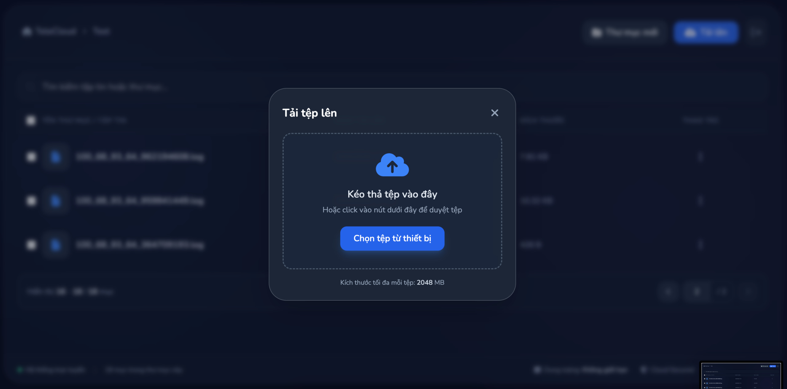
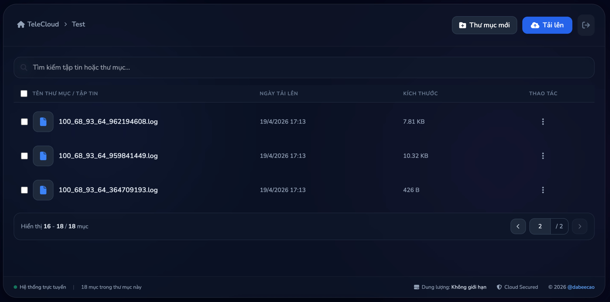
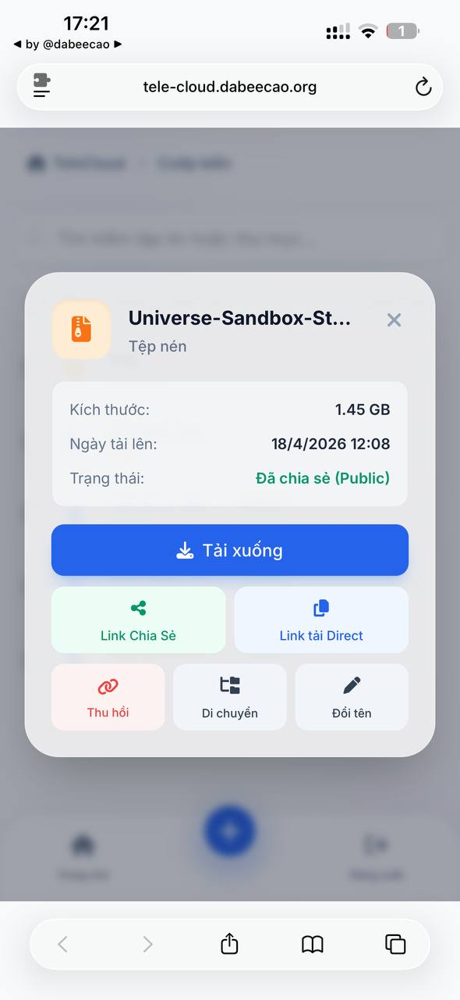
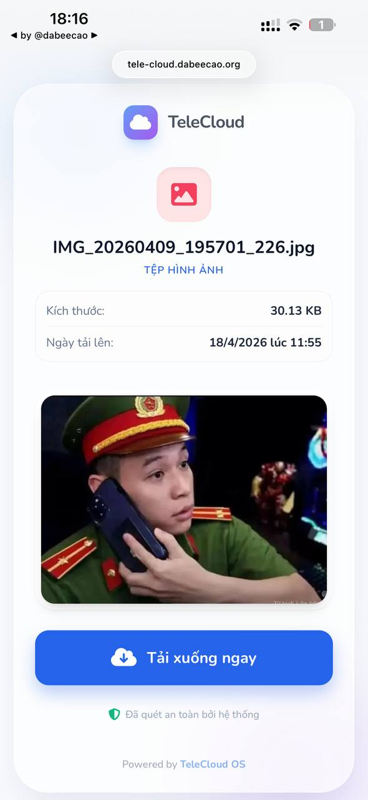
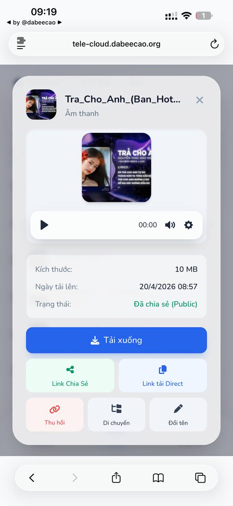
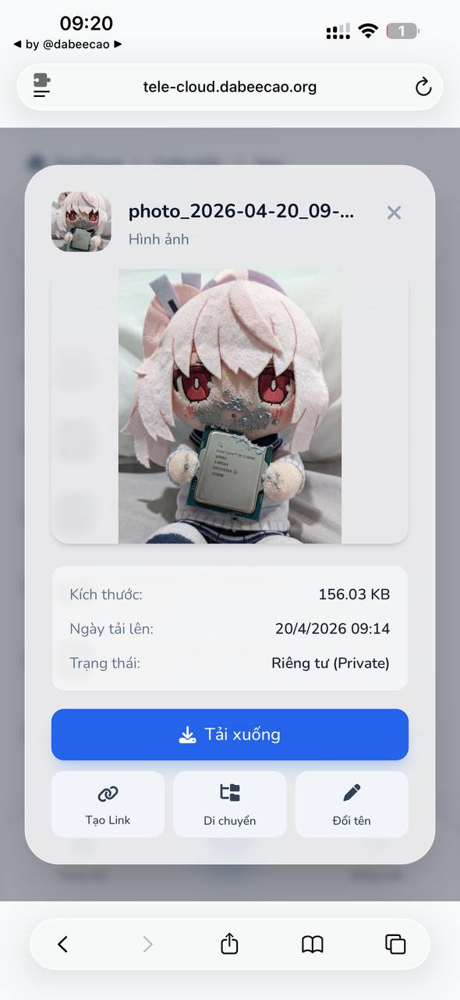
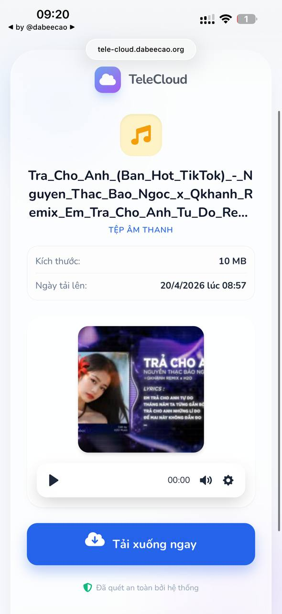

# TeleCloud 

<div align="center">

[🇻🇳 Tiếng Việt](./readme.md) | [🇺🇸 English](./readme_en.md)

</div>

**TeleCloud** is a project that allows you to use Telegram’s nearly unlimited storage capacity to store and manage files.

This project has been **completely rewritten in Golang** from the original project [dabeecao/tele-cloud](https://github.com/dabeecao/tele-cloud), delivering excellent performance, extremely low memory usage, and the ability to compile into a single executable (binary) that can run anywhere without requiring a development environment.

---

## 📸 Preview

### 🖥️ Desktop Interface
| | | |
| :---: | :---: | :---: |
|  |  |  |

### 📱 Mobile Interface
| | | | |
| :---: | :---: | :---: | :---: |
|  |  |  |  |

> *The interface is optimized for all devices (Responsive Design)*

---

## ✨ Features

* 📁 Store files directly on Telegram with virtually unlimited storage
* 🎬 Stream videos and music directly in the web interface and shared links
* 🔗 Share links with options for normal links or direct download links
* 🗂️ Intuitive file management interface (File Browser)
* ⬆️ High-speed parallel uploads (multi-threading)
* 📦 Chunked uploads for better speed and stability
* 👤 Supports **Userbot** with powerful **MTProto** (upload files up to 2GB/4GB)
* 📂 **WebDAV** Support: Mount TeleCloud as a network drive on your computer (Windows, macOS, Linux).
* 🌐 **Multi-language**: Supports Vietnamese and English UI

---

## 🚀 Quick Installation Guide (Using Prebuilt Binary)

This is the fastest way to run TeleCloud without installing a development environment.

### 1. System Requirements

You need to install **FFmpeg** so the system can generate thumbnails for videos and audio files.

* **Ubuntu/Debian:** `sudo apt install ffmpeg`
* **Redhat-based:** `sudo yum install ffmpeg` via [RPM Fusion](https://rpmfusion.org/)
* **Alpine Linux:** `apk add ffmpeg`
* **Windows:** Download a prebuilt version from [ffmpeg.org](https://ffmpeg.org/download.html) and add it to PATH.

If FFmpeg is not installed, the project will still run, but thumbnail generation will not work.

---

### 2. Download TeleCloud

Go to the [**Releases**](https://github.com/dabeecao/telecloud-go/releases) section and download the appropriate version for your OS (Linux, Windows, or macOS).

---

### 3. Environment Configuration

In the directory containing the binary file, you will find a file named `env.example`. Copy it to `.env` and fill in your information:

```bash
cp env.example .env
```

Main fields in `.env`:

* `API_ID` & `API_HASH`: Get from [https://my.telegram.org](https://my.telegram.org)
* `LOG_GROUP_ID`: ID of the group/channel storing files or use `me` for Saved Messages
* `ADMIN_PASSWORD`: Password to access the web interface
* `PORT`: Port to run the application
* `MAX_UPLOAD_SIZE_MB`: Maximum upload file size (Premium accounts can go up to 4096MB)
* `DATABASE_PATH`: Path to the database file
* `THUMBS_DIR`: Directory for storing thumbnails
* `WEBDAV_ENABLED`: Enable/Disable WebDAV server (`true` or `false`)
* `WEBDAV_USER`: WebDAV username
* `WEBDAV_PASSWORD`: WebDAV password

---

#### 🔑 Get API_ID and API_HASH

* Visit: [https://my.telegram.org](https://my.telegram.org)
* Log in with your Telegram phone number
* Select **API development tools**
* Create a new app
* Retrieve:

  * `API_ID`
  * `API_HASH`

---

#### 📡 Get LOG_GROUP_ID

* Create a Telegram group and add your Userbot (or just create a private group with yourself)
* Make sure chat history is enabled in group settings
* Add bot [@get_all_tetegram_id_bot](https://t.me/get_all_telegram_id_bot) to the group and run `/getid`

Example response:

```
🔹 CURRENT SESSION / PHIÊN HIỆN TẠI

• User ID / ID Người dùng: 36xxxxxxxx
• Chat ID / ID Trò chuyện: -100xxxxxxxxxx
• Message ID / ID Tin nhắn: x
• Chat Type / Loại hội thoại: supergroup
```

Use the **Chat ID** as your `LOG_GROUP_ID`, typically in this format:

```
-100xxxxxxxxxx
```

---

### 4. Login & Run

Open terminal in the binary directory:

**Step A: Authenticate (first time only)**

```bash
# Linux/macOS
./telecloud -auth

# Windows
telecloud.exe -auth
```

Enter your phone number, OTP, and 2FA password (if any).

---

**Step B: Start the server**

```bash
./telecloud
```

Access the web interface at: `http://localhost:8091`
WebDAV at: `http://localhost:8091/webdav`

---

## 🛠️ Build from Source (For Developers)

1. Install **Golang (1.21+)**: [https://golang.org/dl/](https://golang.org/dl/)
2. Clone the project:

```bash
git clone https://github.com/dabeecao/telecloud-go.git
```

3. Configure `.env` as above
4. Install dependencies:

```bash
go mod tidy
```

5. Build UI (Tailwind CSS):
   * Download the **Tailwind CLI** for your OS from [Tailwind CSS Releases](https://github.com/tailwindlabs/tailwindcss/releases/latest).
   * Rename the downloaded file to `tailwindcss` (or `tailwindcss.exe` on Windows) and place it in the project root.
   * Run the build command:
     ```bash
     # Linux/macOS
     chmod +x build-css.sh
     ./build-css.sh

     # Windows
     build-css.bat
     ```

6. Run:

```bash
go run .
```

7. Or build binary:

```bash
go build -o telecloud
```

---

## ⚠️ Terms of Use & Disclaimer

**TeleCloud** is developed for storing and managing legitimate personal files. We are not responsible for any content uploaded by users or violations of Telegram’s terms of service. Users are **fully responsible** for their own actions.

The project is provided **“as-is”**, without any guarantees of stability or security.

---

## 🙏 Credits

This project uses amazing libraries:

* [gotd/td](https://github.com/gotd/td): Telegram client (MTProto API)
* [Gin](https://github.com/gin-gonic/gin): High-performance HTTP web framework
* [AlpineJS](https://github.com/alpinejs/alpine): Minimal JS framework
* [TailwindCSS](https://github.com/tailwindlabs/tailwindcss): Utility-first CSS framework
* [plyr](https://github.com/sampotts/plyr): HTML5 media player

Thanks to all contributors for their great tools.

**A portion of the project's source code and this readme was referenced and modified by Gemini AI.**

---

## 🎁 Support

If you find this project useful and want to support me and future projects, visit:
[https://dabeecao.org#donate](https://dabeecao.org#donate)

---

## 📜 License

This project is licensed under the
[GNU Affero General Public License v3.0 (AGPL-3.0)](https://www.gnu.org/licenses/agpl-3.0.html)
